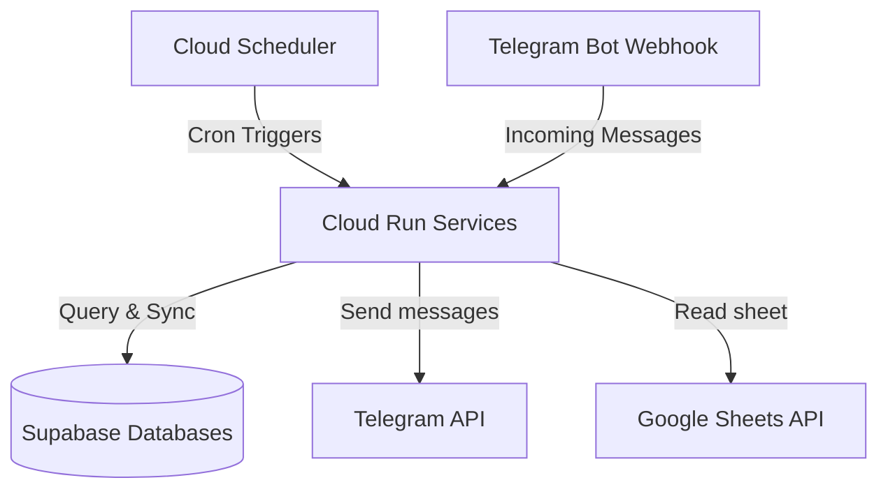

# Ahun GCP Infrastructure-as-Code (Terraform)

This repository contains the modular, serverless infrastructure configuration for deploying the **Ahun Services** (e.g., Members Service, Duty Service, and future microservices) on Google Cloud Platform (GCP) and Supabase for **free** (Always Free tier eligible).

---

## Architecture



*   **Cloud Run:** Runs the Spring Boot container serverless. Scales down to **0 instances** when idle, avoiding all running costs.
*   **Cloud Scheduler:** Automatically triggers the endpoints securely at configured cron times.
*   **Artifact Registry:** Securely stores Docker images for your applications.
*   **IAM Service Accounts:** Implements least-privilege security by running the app under a dedicated custom Service Account.

---

## Project Structure

```
~/Projects/IaC/ahun/
├── main.tf                  # Root main.tf (calls modules for each service)
├── variables.tf             # Root variables declaration
├── outputs.tf               # Root outputs declaration
├── apis.tf                  # Automatically enables required GCP APIs
├── README.md                # This documentation
├── terraform.tfvars.example # Template of variables to provide
└── modules/
    └── cloud_run/           # Reusable Module for serverless Cloud Run resources
    └── supabase/            # Reusable Module for Supabase Projects
```

---

## Setting up Telegram Bots (BotFather & Webhooks)

If your services act as Telegram bots (like `ahun-members-service` and `ahun-duty-service`), follow these steps:

### 1. Create the Bots in BotFather
1. Open Telegram and search for **@BotFather**.
2. Send `/newbot` and follow the prompts to create your bots (one for members, one for duty).
3. BotFather will provide an **HTTP API Token** for each bot (e.g., `123456789:ABCDEF...`).

### 2. Inject Tokens via Terraform
Add these tokens to your `terraform.tfvars` file and inject them into the `env_vars` block of your `module` definitions in `main.tf`.

### 3. Register the Webhooks
After running `terraform apply`, GCP will generate a secure `https://` URL for each of your Cloud Run services. You must tell Telegram to forward incoming messages to these URLs.

Run this command in your terminal for each bot:
```bash
curl -X POST "https://api.telegram.org/bot<YOUR_BOT_TOKEN>/setWebhook" \
     -d "url=https://<YOUR_CLOUD_RUN_SERVICE_URL>/api/webhook"
```
*(Ensure you replace `/api/webhook` with the actual path your Spring Boot application uses to receive updates).*

---

## How to Deploy

### Step 1: Initialize variables
```bash
cp terraform.tfvars.example terraform.tfvars
```
Fill in your GCP project ID, Supabase connection details, and Telegram credentials in the `terraform.tfvars` file.

For the Google Cloud credentials, set it as an environment variable before running Terraform commands to keep your JSON key secure:
```bash
export TF_VAR_google_credentials=$(cat /path/to/your/credentials.json)
```

### Step 2: Create the Artifact Registries first
Before Cloud Run can pull the container images, the registries must exist. Run:
```bash
terraform init
terraform apply -target=module.ahun_members_service.google_artifact_registry_repository.repo -target=module.ahun_duty_service.google_artifact_registry_repository.repo
```

### Step 3: Build & Push the App Images using Cloud Build
Compile it directly in the cloud for free using Cloud Build:
```bash
# For Members Service
cd ~/Projects/Ahun/ahun-members-service
gcloud builds submit --tag us-central1-docker.pkg.dev/your-gcp-project-id/ahun-members-service-repo/ahun-members-service:latest .

# For Duty Service
cd ~/Projects/Ahun/ahun-duty-service
gcloud builds submit --tag us-central1-docker.pkg.dev/your-gcp-project-id/ahun-duty-service-repo/ahun-duty-service:latest .
```

### Step 4: Apply the Full Infrastructure
Go back to the IaC directory and apply the full plan:
```bash
cd ~/Projects/IaC/ahun-cloud-env
terraform apply
```

---

## Adding More Microservices

To add another microservice, simply add another `module "cloud_run"` block in `main.tf`. Pass any environment variables it needs using the generic `env_vars` map, and define cron jobs using `scheduler_jobs`.

```hcl
module "billing_service" {
  source       = "./modules/cloud_run"
  project_id   = var.project_id
  region       = var.region
  service_name = "billing-service"

  env_vars = {
    DATABASE_URL = module.supabase.spring_datasource_urls["billing"]
    API_KEY      = "secret"
  }
  
  scheduler_jobs = {
    "weekly-report" = {
      description = "Generates weekly billing reports"
      schedule    = "0 10 * * 1"
      time_zone   = "America/Sao_Paulo"
      uri_path    = "/api/reports/generate"
      http_method = "POST"
      body        = ""
    }
  }
}
```
