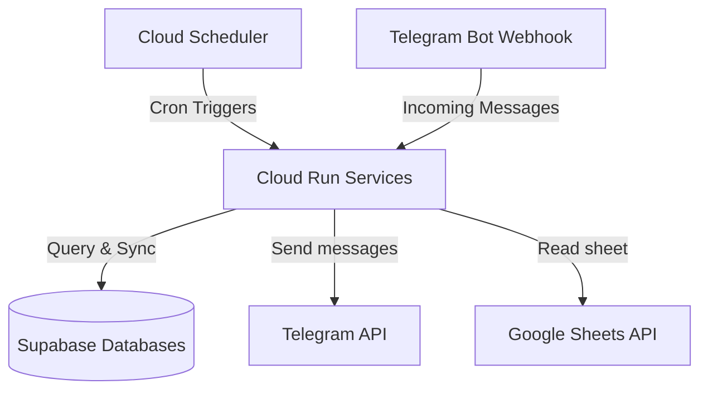

# Ahun GCP Infrastructure-as-Code (Terraform)

This repository contains the modular, serverless infrastructure configuration for deploying the **Ahun Services** (e.g., Members Service, Duty Service, and future microservices) on Google Cloud Platform (GCP) and Supabase for **free** (Always Free tier eligible).

---

## Architecture



*   **Cloud Run:** Runs the Spring Boot container serverless. Scales down to **0 instances** when idle, avoiding all running costs.
*   **Cloud Scheduler:** Automatically triggers the endpoints securely at configured cron times.
*   **Artifact Registry:** Securely stores Docker images for your applications.
*   **IAM Service Accounts:** Implements least-privilege security by running the app under a dedicated custom Service Account.

---

## Project Structure

```
~/Projects/IaC/ahun/
├── main.tf                  # Root main.tf (calls modules for each service)
├── variables.tf             # Root variables declaration
├── outputs.tf               # Root outputs declaration
├── apis.tf                  # Automatically enables required GCP APIs
├── README.md                # This documentation
├── terraform.tfvars.example # Template of variables to provide
└── modules/
    └── cloud_run/           # Reusable Module for serverless Cloud Run resources
    └── supabase/            # Reusable Module for Supabase Projects
    └── telegram_bot/        # Reusable Module: token in Secret Manager + bot profile
```

---

## Setting up the Telegram Bot (BotFather + `telegram_bot` module)

Both services share **one** Telegram bot. `ahun-members-service` talks to the
Telegram Bot API through `org.telegram:telegrambots-spring-boot-starter`
(`TelegramBotAdapter`). It uses long polling and only *sends* messages: Cloud
Scheduler calls `POST /api/messaging/send` daily/monthly and the adapter pushes
the birthday / monthly digest to a chat. It needs two settings:
`TELEGRAM_BOT_TOKEN` (from BotFather) and `TELEGRAM_CHAT_ID` (the target
chat/group id). `ahun-duty-service` gets the same token wired in, ready for when
its Telegram integration is built; per-service routing stays via each service's
own `TELEGRAM_CHAT_ID`.

### 1. Create the bot in BotFather (one-time, manual)

Telegram has **no API to create a bot or mint a token** — that is BotFather only.

1. Open Telegram, chat with **@BotFather**.
2. Send `/newbot` and follow the prompts (one bot only).
3. Copy the **HTTP API token** (e.g. `123456789:ABCDEF...`).

### 2. Put the token in `terraform.tfvars`

```hcl
telegram_bot_token = "<bot token from BotFather>"
telegram_chat_id   = "<target chat id, e.g. -1001234567890>"
```

### 3. What Terraform then manages

The `modules/telegram_bot` module (instantiated once as `module.telegram_bot` in
`main.tf`, with `bot_name = "ahun"`):

*   **Secret Manager** — stores the token as `ahun-telegram-bot-token`. Both Cloud
    Run services consume it via a `secret_key_ref` env var (no plaintext token in
    state or on the revision), and each service's app service account is granted
    `roles/secretmanager.secretAccessor` on it.
*   **Token validation** — the `telegram_bot` data source calls `getMe` on every
    plan/apply; `terraform output bot_link` shows the resolved `t.me/...` handle.
*   **Bot profile** — `commands` (setMyCommands) and `webhook_url` (setWebhook)
    inputs, managed via the `yi-jiayu/telegram` provider. `webhook_url` defaults
    to empty — the members bot stays on long polling, so leave it that way
    (setting a webhook disables `getUpdates`).

> The provider covers webhook + commands only. Bot name / description / about
> text are still changed through BotFather.

### 4. Command menu (`commands`)

`main.tf` already registers the shared bot's slash-command menu, built from what
each service does:

| Command | Service | Purpose |
|---|---|---|
| `/aniversariantes` | members | Birthdays in the current month |
| `/aniversariantes_hoje` | members | Birthdays today |
| `/membros` | members | List all registered members |
| `/sincronizar` | members | Sync the Google Sheet into the database |
| `/escala` | duty | Current duty roster |
| `/escala_proxima` | duty | Next duty roster |
| `/escala_cartao` | duty | Generate the duty-roster card |

`setMyCommands` only publishes the **menu** (what users see when they type `/`).
The behaviour behind each command must be implemented in the owning service's
Telegram update handler. Today `ahun-members-service` is send-only
(`onUpdateReceived` is empty) and `ahun-duty-service` has no Telegram code yet,
so the `escala*` entries are menu-only placeholders. Edit the `commands` list in
the `module "telegram_bot"` block in `main.tf` to add or change entries.

---

## How to Deploy

### Step 1: Initialize variables
```bash
cp terraform.tfvars.example terraform.tfvars
```
Fill in your GCP project ID, Supabase connection details, and Telegram credentials in the `terraform.tfvars` file.

For the Google Cloud credentials, set it as an environment variable before running Terraform commands to keep your JSON key secure:
```bash
export TF_VAR_google_credentials=$(cat /path/to/your/credentials.json)
```

### Step 2: Apply the infrastructure
```bash
terraform init
terraform apply
```
Each Cloud Run service comes up on a public placeholder image
(`us-docker.pkg.dev/cloudrun/container/hello`) and its Artifact Registry repo is
created alongside it — no targeted apply or pre-build needed. Terraform owns the
service's env vars, secret refs, scaling and scheduler; the `image` field is
`ignore_changes`d so the pipeline can own it.

### Step 3: Let the CI/CD pipeline build and deploy the real image
The service's GitHub Actions pipeline (`.github/workflows/deploy.yml`) builds the
container, pushes it to the repo Terraform created, and runs `gcloud run deploy`
to roll out the real revision:

```
us-central1-docker.pkg.dev/<project>/ahun-members-service/ahun-members-service:<version>
```

The repo id is the **service name** (`ahun-members-service`), so the pipeline's
`ARTIFACT_REGISTRY_REPO` must be set to that (no `-repo` suffix). To build
manually instead of via the pipeline:
```bash
cd ~/Projects/Ahun/ahun-members-service
gcloud builds submit --tag us-central1-docker.pkg.dev/your-gcp-project-id/ahun-members-service/ahun-members-service:latest .
```

Re-running `terraform apply` later will not revert the pipeline-deployed image.

---

## Adding More Microservices

To add another microservice, simply add another `module "cloud_run"` block in `main.tf`. Pass any environment variables it needs using the generic `env_vars` map, and define cron jobs using `scheduler_jobs`.

```hcl
module "billing_service" {
  source       = "./modules/cloud_run"
  project_id   = var.project_id
  region       = var.region
  service_name = "billing-service"

  env_vars = {
    DATABASE_URL = module.supabase.spring_datasource_urls["billing"]
    API_KEY      = "secret"
  }
  
  scheduler_jobs = {
    "weekly-report" = {
      description = "Generates weekly billing reports"
      schedule    = "0 10 * * 1"
      time_zone   = "America/Sao_Paulo"
      uri_path    = "/api/reports/generate"
      http_method = "POST"
      body        = ""
    }
  }
}
```
