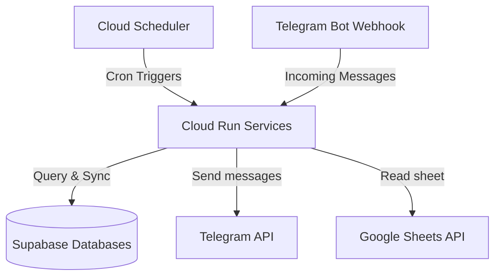

# Ahun GCP Infrastructure-as-Code (Terraform)

This repository contains the modular, serverless infrastructure configuration for deploying the **Ahun Services** (e.g., Members Service, Duty Service, and future microservices) on Google Cloud Platform (GCP) and Supabase for **free** (Always Free tier eligible).

---

## Architecture



*   **Cloud Run:** Runs the Spring Boot container serverless. Scales down to **0 instances** when idle, avoiding all running costs.
*   **Cloud Scheduler:** Automatically triggers the endpoints securely at configured cron times.
*   **Artifact Registry:** Securely stores Docker images for your applications.
*   **IAM Service Accounts:** Implements least-privilege security by running the app under a dedicated custom Service Account.

---

## Project Structure

```
~/Projects/IaC/ahun/
├── main.tf                  # Root main.tf (calls modules for each service)
├── variables.tf             # Root variables declaration
├── outputs.tf               # Root outputs declaration
├── apis.tf                  # Automatically enables required GCP APIs
├── README.md                # This documentation
├── terraform.tfvars.example # Template of variables to provide
└── modules/
    └── cloud_run/           # Reusable Module for serverless Cloud Run resources
    └── supabase/            # Reusable Module for Supabase Projects
    └── telegram_bot/        # Reusable Module: token in Secret Manager + bot profile
```

---

## Setting up Telegram Bots (BotFather + `telegram_bot` module)

`ahun-members-service` talks to the Telegram Bot API through
`org.telegram:telegrambots-spring-boot-starter` (`TelegramBotAdapter`). It uses
long polling and only *sends* messages: Cloud Scheduler calls
`POST /api/messaging/send` daily/monthly and the adapter pushes the birthday /
monthly digest to a chat. It needs two settings: `TELEGRAM_BOT_TOKEN` (from
BotFather) and `TELEGRAM_CHAT_ID` (the target chat/group id).

### 1. Create the bots in BotFather (one-time, manual)

Telegram has **no API to create a bot or mint a token** — that is BotFather only.

1. Open Telegram, chat with **@BotFather**.
2. Send `/newbot` and follow the prompts. Do this twice (members + duty).
3. Copy the **HTTP API token** for each bot (e.g. `123456789:ABCDEF...`).

### 2. Put the tokens in `terraform.tfvars`

```hcl
telegram_bot_token      = "<members bot token from BotFather>"
duty_telegram_bot_token = "<duty bot token from BotFather>"
telegram_chat_id        = "<target chat id, e.g. -1001234567890>"
```

### 3. What Terraform then manages

The `modules/telegram_bot` module (instantiated as `module.telegram_members` and
`module.telegram_duty` in `main.tf`):

*   **Secret Manager** — stores each token as `${bot_name}-telegram-bot-token`.
    The Cloud Run service consumes it via a `secret_key_ref` env var (no plaintext
    token in state or on the revision), and the app service account is granted
    `roles/secretmanager.secretAccessor` on it.
*   **Token validation** — the `telegram_bot` data source calls `getMe` on every
    plan/apply; `terraform output members_bot_link` / `duty_bot_link` show the
    resolved `t.me/...` handle.
*   **Bot profile** — optional `commands` (setMyCommands) and `webhook_url`
    (setWebhook) inputs, managed via the `yi-jiayu/telegram` provider. Both
    default to empty. The members bot stays on long polling, so leave
    `webhook_url` empty (setting a webhook disables `getUpdates`).

> The provider covers webhook + commands only. Bot name / description / about
> text are still changed through BotFather.

To register commands for a bot, pass them to its module block in `main.tf`:

```hcl
module "telegram_members" {
  source   = "./modules/telegram_bot"
  bot_name = "ahun-members-service"
  bot_token = var.telegram_bot_token

  commands = [
    { command = "status", description = "Show sync status" },
  ]

  providers = { telegram = telegram.members }
}
```

---

## How to Deploy

### Step 1: Initialize variables
```bash
cp terraform.tfvars.example terraform.tfvars
```
Fill in your GCP project ID, Supabase connection details, and Telegram credentials in the `terraform.tfvars` file.

For the Google Cloud credentials, set it as an environment variable before running Terraform commands to keep your JSON key secure:
```bash
export TF_VAR_google_credentials=$(cat /path/to/your/credentials.json)
```

### Step 2: Create the Artifact Registries first
Before Cloud Run can pull the container images, the registries must exist. Run:
```bash
terraform init
terraform apply -target=module.ahun_members_service.google_artifact_registry_repository.repo -target=module.ahun_duty_service.google_artifact_registry_repository.repo
```

### Step 3: Build & Push the App Images using Cloud Build
Compile it directly in the cloud for free using Cloud Build:
```bash
# For Members Service
cd ~/Projects/Ahun/ahun-members-service
gcloud builds submit --tag us-central1-docker.pkg.dev/your-gcp-project-id/ahun-members-service-repo/ahun-members-service:latest .

# For Duty Service
cd ~/Projects/Ahun/ahun-duty-service
gcloud builds submit --tag us-central1-docker.pkg.dev/your-gcp-project-id/ahun-duty-service-repo/ahun-duty-service:latest .
```

### Step 4: Apply the Full Infrastructure
Go back to the IaC directory and apply the full plan:
```bash
cd ~/Projects/IaC/ahun-cloud-env
terraform apply
```

---

## Adding More Microservices

To add another microservice, simply add another `module "cloud_run"` block in `main.tf`. Pass any environment variables it needs using the generic `env_vars` map, and define cron jobs using `scheduler_jobs`.

```hcl
module "billing_service" {
  source       = "./modules/cloud_run"
  project_id   = var.project_id
  region       = var.region
  service_name = "billing-service"

  env_vars = {
    DATABASE_URL = module.supabase.spring_datasource_urls["billing"]
    API_KEY      = "secret"
  }
  
  scheduler_jobs = {
    "weekly-report" = {
      description = "Generates weekly billing reports"
      schedule    = "0 10 * * 1"
      time_zone   = "America/Sao_Paulo"
      uri_path    = "/api/reports/generate"
      http_method = "POST"
      body        = ""
    }
  }
}
```
