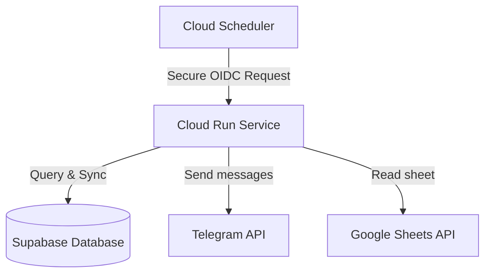

# Ahun GCP Infrastructure-as-Code (Terraform)

This repository contains the modular, serverless infrastructure configuration for deploying the **Ahun Members Service** (and future microservices) on Google Cloud Platform (GCP) for **free** (Always Free tier eligible).

---

## Architecture



*   **Cloud Run:** Runs the Spring Boot container serverless. Scales down to **0 instances** when idle, avoiding all running costs.
*   **Cloud Scheduler:** Automatically triggers the Spring Boot `/api/messaging/send` endpoint securely at configured cron times.
*   **Artifact Registry:** Securely stores Docker images for your applications.
*   **IAM Service Accounts:** Implements least-privilege security by running the app under a dedicated custom Service Account (`ahun-app-sa`).

---

## Project Structure

```
~/Projects/IaC/ahun/
├── main.tf                  # Root main.tf (calls modules)
├── variables.tf             # Root variables declaration
├── outputs.tf               # Root outputs declaration
├── apis.tf                  # Automatically enables required GCP APIs
├── README.md                # This documentation
├── terraform.tfvars.example # Template of variables to provide
└── modules/
    └── cloud_run/           # Module for serverless Cloud Run resources
        ├── main.tf          # Core Cloud Run Service
        ├── registry.tf      # Artifact Registry Repository
        ├── iam.tf           # Service Accounts and OIDC bindings
        ├── scheduler.tf     # Cloud Scheduler Cron Jobs
        ├── variables.tf     # Module variables
        └── outputs.tf       # Module outputs
```

---

## ⚙Prerequisites

1.  **GCP Account & Project:** Create a GCP Project and set up billing (billing details are required, but you will stay in the free tier).
2.  **Google Cloud CLI:** Install and authenticate:
    ```bash
    gcloud auth application-default login
    ```
3.  **Terraform:** Install Terraform (`>= 1.0.0`).
4.  **Supabase PostgreSQL Database:** Create a free database on Supabase and copy the connection string.

---

## How to Deploy (Zero-Touch Container Compilation)

### Step 1: Initialize variables
1. In this directory, copy the example variables file:
   ```bash
   cp terraform.tfvars.example terraform.tfvars
   ```
2. Open `terraform.tfvars` and fill in your GCP project ID, Supabase connection details, and Telegram credentials. (Leave `google_credentials` unset to default to `"DEFAULT_GCP"`).

### Step 2: Create the Artifact Registry first
Before Cloud Run can pull the container image, the registry must exist. Run:
```bash
terraform init
terraform apply -target=module.cloud_run.google_artifact_registry_repository.repo
```

### Step 3: Build & Push the App Image using Cloud Build
Instead of building Docker images locally, compile it directly in the cloud for free using Cloud Build:
1. Navigate to the Spring Boot application directory:
   ```bash
   cd ~/Projects/APIs/ahun/ahun-members-service
   ```
2. Run the submission build (replace `your-gcp-project-id` with your actual GCP Project ID):
   ```bash
   gcloud builds submit --tag us-central1-docker.pkg.dev/your-gcp-project-id/ahun-repo/ahun-members-service:latest .
   ```

### Step 4: Apply the Full Infrastructure
1. Go back to the IaC directory:
   ```bash
   cd ~/Projects/IaC/ahun
   ```
2. Apply the full plan:
   ```bash
   terraform apply
   ```
   *(Type `yes` when prompted. Wait 1-2 minutes for completion).*

---

## Access Control Setup (No JSON keys required)

When the deploy finishes, Terraform will output the email address of the application's dedicated Service Account:
```hcl
app_service_account_email = "ahun-app-sa@your-project-id.iam.gserviceaccount.com"
```

1.  Open your **Google Sheet** in the browser.
2.  Click the blue **Share** button.
3.  Add the `app_service_account_email` address.
4.  Grant it **Editor** (or **Viewer**) access.
5.  Save.

---

## Adding More Microservices

To add another microservice, simply add another `module "cloud_run"` block in the root [main.tf](file:///home/petrolal/Projects/IaC/ahun/main.tf) with a different `service_name` (e.g. `service_name = "another-app"`). Since all resources inside the module are prefixed with `service_name`, they will deploy isolated resources with no naming collisions!
