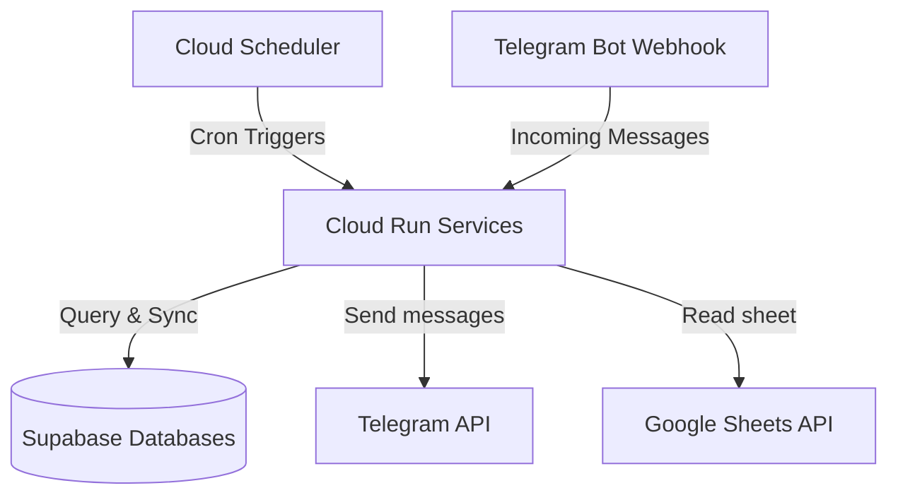

# Ahun GCP Infrastructure-as-Code (Terraform)

This repository contains the modular, serverless infrastructure configuration for deploying the **Ahun Services** (e.g., Members Service, Duty Service, and future microservices) on Google Cloud Platform (GCP) and Supabase for **free** (Always Free tier eligible).

---

## Architecture



*   **Cloud Run:** Runs the Spring Boot container serverless. Scales down to **0 instances** when idle, avoiding all running costs.
*   **Cloud Scheduler:** Automatically triggers the endpoints securely at configured cron times.
*   **Artifact Registry:** Securely stores Docker images for your applications.
*   **IAM Service Accounts:** Implements least-privilege security by running the app under a dedicated custom Service Account.

---

## Project Structure

This repo — **shared infra only**:

```
~/Projects/IaC/ahun-cloud-env/
├── main.tf                  # SHARED root: Supabase projects + Telegram bot
├── variables.tf             # Shared root variables
├── outputs.tf               # Shared root outputs (feed these to service pipelines)
├── apis.tf                  # Enables required GCP APIs on the project
├── terraform.tfvars.example # Template for the shared root
└── modules/
    ├── supabase/            # Reusable: Supabase Projects
    └── telegram_bot/        # Reusable: token in Secret Manager + bot profile
```

Each **service repo** — its own Cloud Run infra, self-contained:

```
~/Projects/Ahun/ahun-members-service/
├── (application code, Dockerfile, …)
└── gcp/                     # PER-SERVICE root, applied by this service's pipeline
    ├── main.tf              #   backend + provider + module "cloud_run" (service_name hardcoded)
    ├── variables.tf
    ├── outputs.tf
    ├── terraform.tfvars.example
    └── modules/
        └── cloud_run/       # VENDORED copy: Cloud Run + Artifact Registry + IAM + Scheduler
```

`ahun-duty-service/gcp/` is the same layout. The `cloud_run` module is vendored
(copied) into each service repo — there are two copies to keep in sync by hand.

### Two Terraform roots

| Root | Lives in | Applied by | Owns | State prefix |
|---|---|---|---|---|
| shared root | this repo | you, once (and when shared config changes) | project APIs, Supabase projects, the shared Telegram bot secret + profile | `terraform/state` |
| `<repo>/gcp/` | each service repo | that service's GitHub Actions pipeline, on every release | that one Cloud Run service, its Artifact Registry repo, service accounts, IAM, Cloud Scheduler jobs | `terraform/state/cloud-run/<service_name>` |

Both roots share the same GCS backend bucket (`casa-ahun-tfstate`), different
prefixes. The service root reads nothing from the shared state directly — its
pipeline passes the shared outputs it needs (`spring_datasource_urls[...]`,
`bot_token_secret`) as `TF_VAR_*` from GitHub Actions secrets.

---

## Setting up the Telegram Bot (BotFather + `telegram_bot` module)

Both services share **one** Telegram bot. `ahun-members-service` talks to the
Telegram Bot API through `org.telegram:telegrambots-spring-boot-starter`
(`TelegramBotAdapter`). It uses long polling and only *sends* messages: Cloud
Scheduler calls `POST /api/messaging/send` daily/monthly and the adapter pushes
the birthday / monthly digest to a chat. It needs two settings:
`TELEGRAM_BOT_TOKEN` (from BotFather) and `TELEGRAM_CHAT_ID` (the target
chat/group id). `ahun-duty-service` gets the same token wired in, ready for when
its Telegram integration is built; per-service routing stays via each service's
own `TELEGRAM_CHAT_ID`.

### 1. Create the bot in BotFather (one-time, manual)

Telegram has **no API to create a bot or mint a token** — that is BotFather only.

1. Open Telegram, chat with **@BotFather**.
2. Send `/newbot` and follow the prompts (one bot only).
3. Copy the **HTTP API token** (e.g. `123456789:ABCDEF...`).

### 2. Put the token in `terraform.tfvars`

```hcl
telegram_bot_token = "<bot token from BotFather>"
telegram_chat_id   = "<target chat id, e.g. -1001234567890>"
```

### 3. What Terraform then manages

The `modules/telegram_bot` module (instantiated once as `module.telegram_bot` in
`main.tf`, with `bot_name = "ahun"`):

*   **Secret Manager** — stores the token as `ahun-telegram-bot-token`. Both Cloud
    Run services consume it via a `secret_key_ref` env var (no plaintext token in
    state or on the revision), and each service's app service account is granted
    `roles/secretmanager.secretAccessor` on it.
*   **Token validation** — the `telegram_bot` data source calls `getMe` on every
    plan/apply; `terraform output bot_link` shows the resolved `t.me/...` handle.
*   **Bot profile** — `commands` (setMyCommands) and `webhook_url` (setWebhook)
    inputs, managed via the `yi-jiayu/telegram` provider. `webhook_url` defaults
    to empty — the members bot stays on long polling, so leave it that way
    (setting a webhook disables `getUpdates`).

> The provider covers webhook + commands only. Bot name / description / about
> text are still changed through BotFather.

### 4. Command menu (`commands`)

`main.tf` already registers the shared bot's slash-command menu, built from what
each service does:

| Command | Service | Purpose |
|---|---|---|
| `/aniversariantes` | members | Birthdays in the current month |
| `/aniversariantes_hoje` | members | Birthdays today |
| `/membros` | members | List all registered members |
| `/sincronizar` | members | Sync the Google Sheet into the database |
| `/escala` | duty | Current duty roster |
| `/escala_proxima` | duty | Next duty roster |
| `/escala_cartao` | duty | Generate the duty-roster card |

`setMyCommands` only publishes the **menu** (what users see when they type `/`).
The behaviour behind each command must be implemented in the owning service's
Telegram update handler. Today `ahun-members-service` is send-only
(`onUpdateReceived` is empty) and `ahun-duty-service` has no Telegram code yet,
so the `escala*` entries are menu-only placeholders. Edit the `commands` list in
the `module "telegram_bot"` block in `main.tf` to add or change entries.

---

## How to Deploy

### Step 1: Initialize variables
```bash
cp terraform.tfvars.example terraform.tfvars
```
Fill in your GCP project ID, Supabase connection details and the shared Telegram
bot token in the `terraform.tfvars` file. (Per-service app config — DB URL, chat
id, Sheets credentials — belongs to each service repo's `gcp/` root, not here.)

Terraform authenticates to GCP with Application Default Credentials
(`gcloud auth application-default login`) or `GOOGLE_APPLICATION_CREDENTIALS`.

### Step 2: Apply the SHARED infrastructure (you, from the repo root)
```bash
terraform init
terraform apply
```
This creates the project API enablement, the two Supabase projects and the
shared Telegram bot (token in Secret Manager + `setMyCommands`). It does **not**
create any Cloud Run service — that is each service repo's `gcp/` root, run by
its pipeline. Apply this shared root **before** any service pipeline runs (the
service roots assume the project APIs are already enabled).

Grab the values the pipelines need:
```bash
terraform output spring_datasource_urls   # -> per-service TF_VAR_spring_datasource_url
terraform output -raw bot_token_secret    # -> TF_VAR_bot_token_secret_id (same for both)
terraform output bot_link
```

### Step 2b: Create the per-service databases in Supabase (one-time)

The `supabase` module names each project's JDBC database after the service
(`ahun_members_service`, `ahun_duty_service`) via `databases[*].database_name`.
Supabase only provisions a database called `postgres`, and the `supabase`
provider has no resource to add another, so create them by hand once after the
projects exist:

```bash
# connection ref is the id from: terraform state show 'module.supabase.supabase_project.db["members"]'
psql "postgresql://postgres:<db-password>@db.<members-ref>.supabase.co:5432/postgres" \
  -c 'CREATE DATABASE ahun_members_service;'
psql "postgresql://postgres:<db-password>@db.<duty-ref>.supabase.co:5432/postgres" \
  -c 'CREATE DATABASE ahun_duty_service;'
```

Caveats of a non-`postgres` database: reachable only on the **direct 5432**
connection (not the 6543 pooler), and invisible to the Supabase REST API,
dashboard editor and automated backups. Flyway/JPA work against it normally. To
go back to the default, drop `database_name` from the `databases` block in
`main.tf` (falls back to `postgres`).

### Step 3: Per-service infra + deploy (the service's GitHub Actions pipeline)

Each service repo carries its own `gcp/` Terraform root. Its
`.github/workflows/deploy.yml` `deploy` job, in order:

1. checks out **its own** repo (it already has `gcp/`);
2. `cd gcp && terraform init` — backend bucket + prefix
   (`terraform/state/cloud-run/<service_name>`) are hardcoded in `gcp/main.tf`;
3. `terraform apply` — creates/updates the Cloud Run service, its Artifact
   Registry repo, service accounts, IAM and scheduler jobs. Terraform
   `ignore_changes` the container image;
4. `gcloud run deploy <service_name> --image …:<version>` — rolls the real image.

`service_name` and the scheduler-job map are hardcoded in each repo's
`gcp/main.tf` (one repo = one service). Only secrets are injected by the pipeline
as `TF_VAR_*`.

**GitHub Actions secrets each service repo needs** (in the `GCP_SA_KEY` environment):

| Secret | Value |
|---|---|
| `GCP_SA_KEY` (or `GOOGLE_CREDENTIALS` / `GCP_CREDENTIALS`) | deployer SA key JSON |
| `GCP_PROJECT_ID` | e.g. `casa-ahun` |
| `SPRING_DATASOURCE_URL` | this service's URL from `terraform output spring_datasource_urls` |
| `SPRING_DATASOURCE_PASSWORD` | Supabase DB password |
| `TELEGRAM_CHAT_ID` | target chat/group id |
| `BOT_TOKEN_SECRET_ID` | `terraform output -raw bot_token_secret` (`ahun-telegram-bot-token`) |
| `SHEETS_GOOGLE_CREDENTIALS` | (members only) service-account JSON for the Sheets sync, or leave unset |

To run a service root by hand instead of via the pipeline:
```bash
cd ~/Projects/Ahun/ahun-members-service/gcp
cp terraform.tfvars.example terraform.tfvars   # fill in
terraform init
terraform apply
```

Re-running either root later will not revert the pipeline-deployed image.

---

## Adding More Microservices

1. **Shared root** (this repo) — add the service to the `module "supabase"`
   `databases` map in `main.tf` (if it needs its own DB) and `terraform apply`.
   Add any new slash commands to the `module "telegram_bot"` `commands` list.
2. **Service repo** — copy `gcp/` from an existing service repo into the new one.
   In `gcp/main.tf` set the hardcoded `service_name`, the backend `prefix`
   (`terraform/state/cloud-run/<service-name>`), and the `scheduler_jobs` map:
   ```hcl
   module "cloud_run" {
     source       = "./modules/cloud_run"
     service_name = "billing-service"
     # …
     scheduler_jobs = {
       "weekly-report" = {
         description = "Generates weekly billing reports"
         schedule    = "0 10 * * 1"
         time_zone   = "America/Sao_Paulo"
         uri_path    = "/api/reports/generate"
         http_method = "POST"
         body        = ""
       }
     }
   }
   ```
3. **Pipeline** — copy a `deploy.yml` into the new service repo, set
   `SERVICE_NAME` / `ARTIFACT_REGISTRY_REPO` to `billing-service`, and add the
   GitHub Actions secrets from the table in Step 3.

For an extra plaintext env var that is not one of the built-in ones, pass
`TF_VAR_extra_env_vars='{"API_KEY":"..."}'` from the pipeline or set
`extra_env_vars` in `gcp/terraform.tfvars`.

> When you change the vendored `cloud_run` module, apply the same edit to every
> service repo's `gcp/modules/cloud_run/` — the copies are independent.
